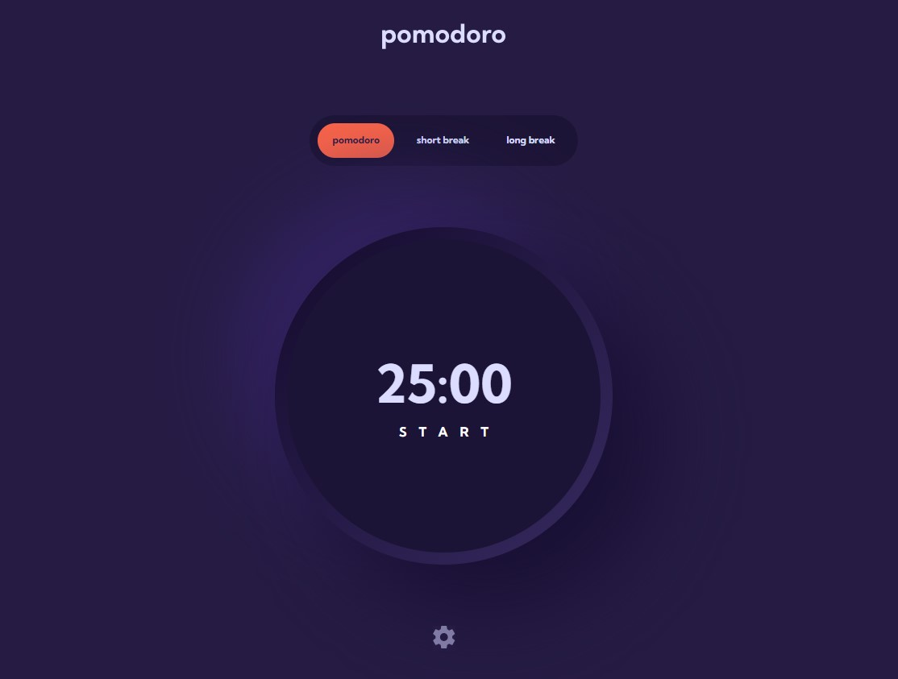

# Frontend Mentor - Pomodoro app solution

This is a solution to the [Pomodoro app challenge on Frontend Mentor](https://www.frontendmentor.io/challenges/pomodoro-app-KBFnycJ6G). Frontend Mentor challenges help you improve your coding skills by building realistic projects.

## Table of contents

- [Overview](#overview)
  - [The challenge](#the-challenge)
  - [Screenshot](#screenshot)
  - [Links](#links)
- [My process](#my-process)
  - [Built with](#built-with)
  - [What I learned](#what-i-learned)
- [Author](#author)

## Overview

### The challenge

Users should be able to:

- Set a pomodoro timer and short & long break timers
- Customize how long each timer runs for
- See a circular progress bar that updates every minute and represents how far through their timer they are
- Customize the appearance of the app with the ability to set preferences for colors and fonts

### Screenshot

### Links

- Solution URL: [Add solution URL here](https://github.com/launamoor/pomodoro_app)
- Live Site URL: [Add live site URL here](https://bjpomodoro.netlify.app)

## My process

### Built with

- Semantic HTML5 markup
- CSS custom properties
- Flexbox
- CSS Grid
- Mobile-first workflow
- [React](https://reactjs.org/) - JS library

### What I learned

During this project, I learned how to animate components using CSS and react-transition-group, effectively manage timers and updates with useEffect, and handle user interactions in React, enhancing my skills in building interactive and engaging frontend applications.

## Author

- Website - [Add your name here](https://bartjozef.com)
- Frontend Mentor - [@yourusername](https://www.frontendmentor.io/profile/launamoor)
